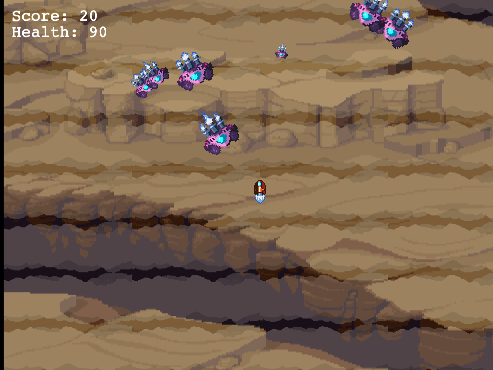
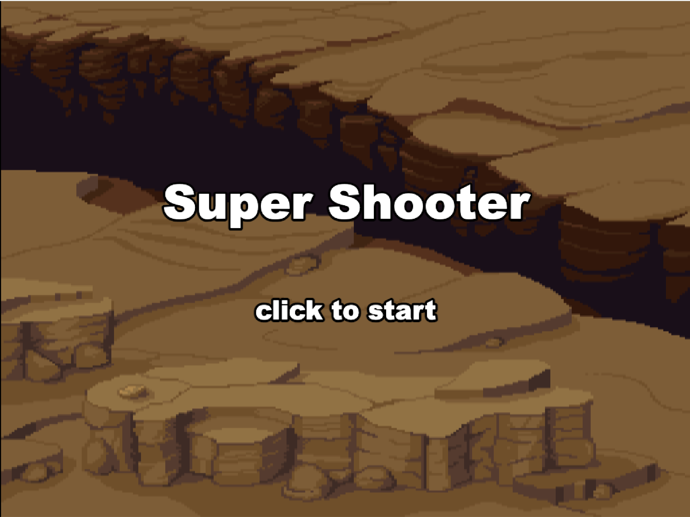

# Game of life

Game of life is a shooter where the goal is to survive the longest time possible

## Preview
|  |  |
| --- | --- |


### Gameplay Video


https://github.com/user-attachments/assets/c904c9b8-75d0-44b5-8c91-e78e5fd28802


## Requirements

[Node.js](https://nodejs.org) is required to install dependencies and run scripts via `npm` (if you want to use the development server).

## Available Commands

| Command | Description |
|---------|-------------|
| `npm install` | Install project dependencies |
| `npm run dev` | Launch a development web server |
| `docker-compose up` | Run the game in production mode using Docker |
| `docker-compose --profile dev up game-of-life-dev` | Run the game in development mode using Docker |

## Writing Code

After cloning the repo, you will need a server to serve the resources of your game. This template provides your own server with hot-reloading. To start it, simply run `npm run dev`.

The local development server runs on `http://localhost:3000` by default.

## Important notes about importmap

- You **MUST** use the `phaser.esm` build of Phaser. This is the only build that exports ES Modules that importmap supports.
- Phaser v3.60.0 was the first version to export an ESM bundle. You cannot use earlier versions with this template.
- The 'name' you give in the importmap (in your `index.html`) should match exactly that used in the `import` declarations within your game code.
- You can store the Phaser ESM build locally if you'd rather not use the CDN. Simply put the `phaser.esm.js` in your local folder structure and reference that inside your HTML like this:

```js
{
    "imports": {
        "phaser": "./my-local-folder/phaser.esm.js"
    }
}
```

## Template Project Structure

We have provided a default project structure to get you started. This is as follows:

- `assets/` - Contains the static assets used by the game.
- `src/` - Contains the game source code.
- `src/scenes/` - The Phaser Scenes are in this folder.
- `src/main.js` - The main entry point. This contains the game configuration and starts the game.
- `index.html` - A basic HTML page to contain the game.
- `style.css` - Some simple CSS rules to help with page layout.

## Deploying to Production

In order to deploy your game, you will need to upload *all* the content of the folder to a public-facing web server.

## Running with Docker

This project includes Docker support for easy deployment and development. You can run the game using Docker Compose without needing to install Node.js locally.

### Requirements

- [Docker](https://www.docker.com/get-started) installed on your system
- [Docker Compose](https://docs.docker.com/compose/install/) (usually included with Docker Desktop)

### Production Mode

To run the game in production mode with nginx:

```bash
docker-compose up
```

This will:
- Build the production Docker image
- Serve the game using nginx on `http://localhost:9000`
- Optimize assets with gzip compression and proper caching headers

### Development Mode

To run the game in development mode with hot reloading:

```bash
docker-compose --profile dev up game-of-life-dev
```

This will:
- Build the development Docker image
- Use alive-server for hot reloading on `http://localhost:9001`
- Mount your local code for real-time changes

### Running Both Services

You can run both production and development services simultaneously:

```bash
docker-compose --profile dev up
```

- Production: `http://localhost:9000`
- Development: `http://localhost:9001`

### Stopping Services

To stop the running containers:

```bash
docker-compose down
```

### Rebuilding Images

If you make changes to the Dockerfile or dependencies, rebuild the images:

```bash
docker-compose build
```

